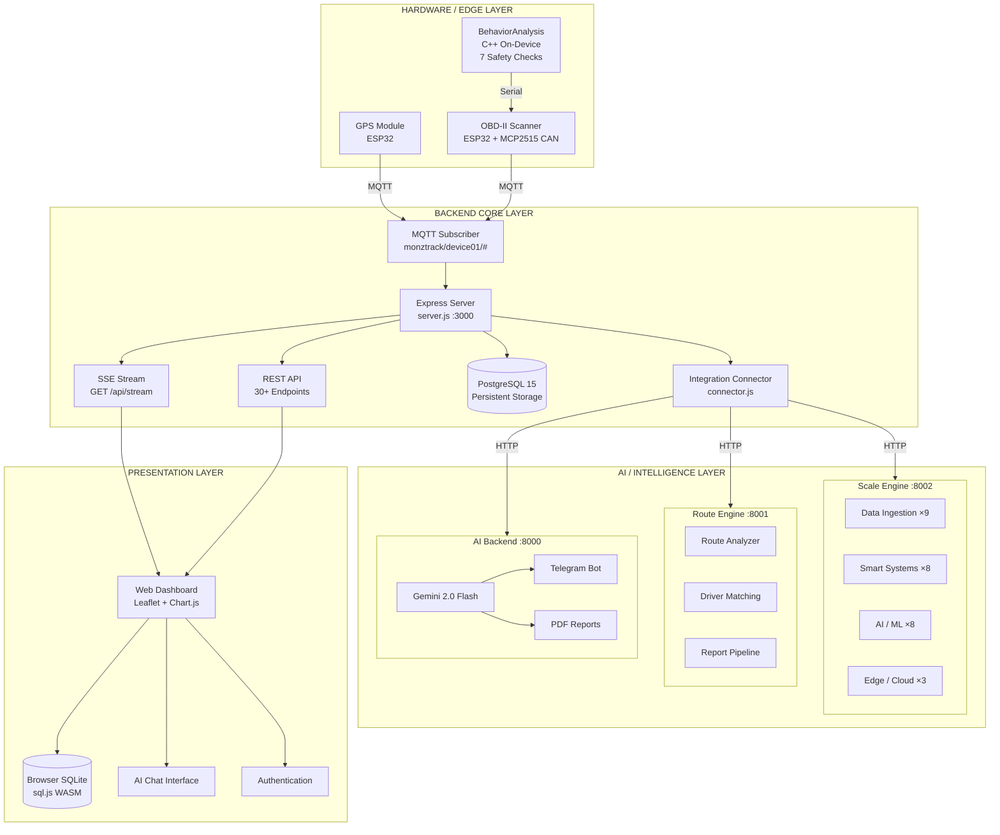
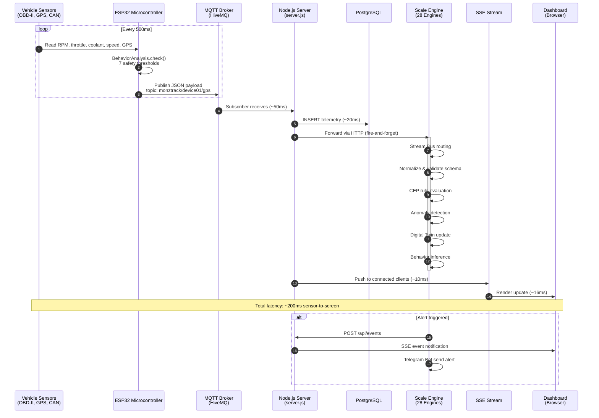
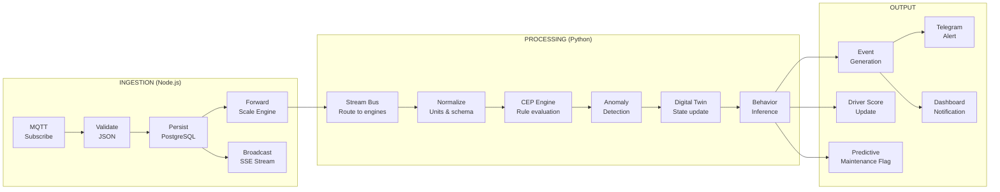
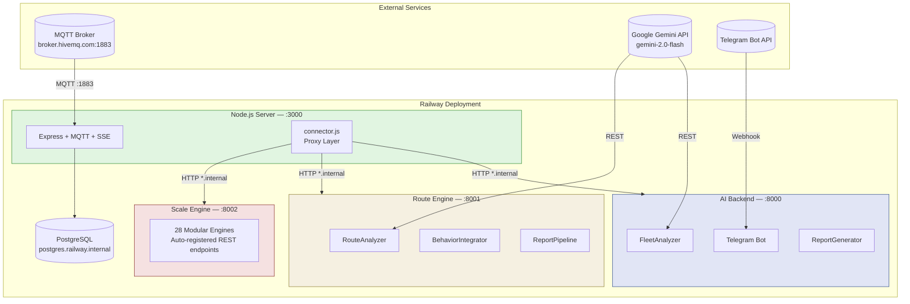
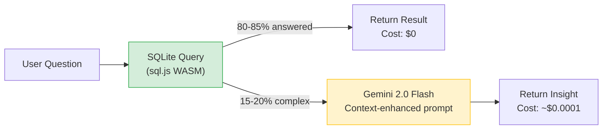
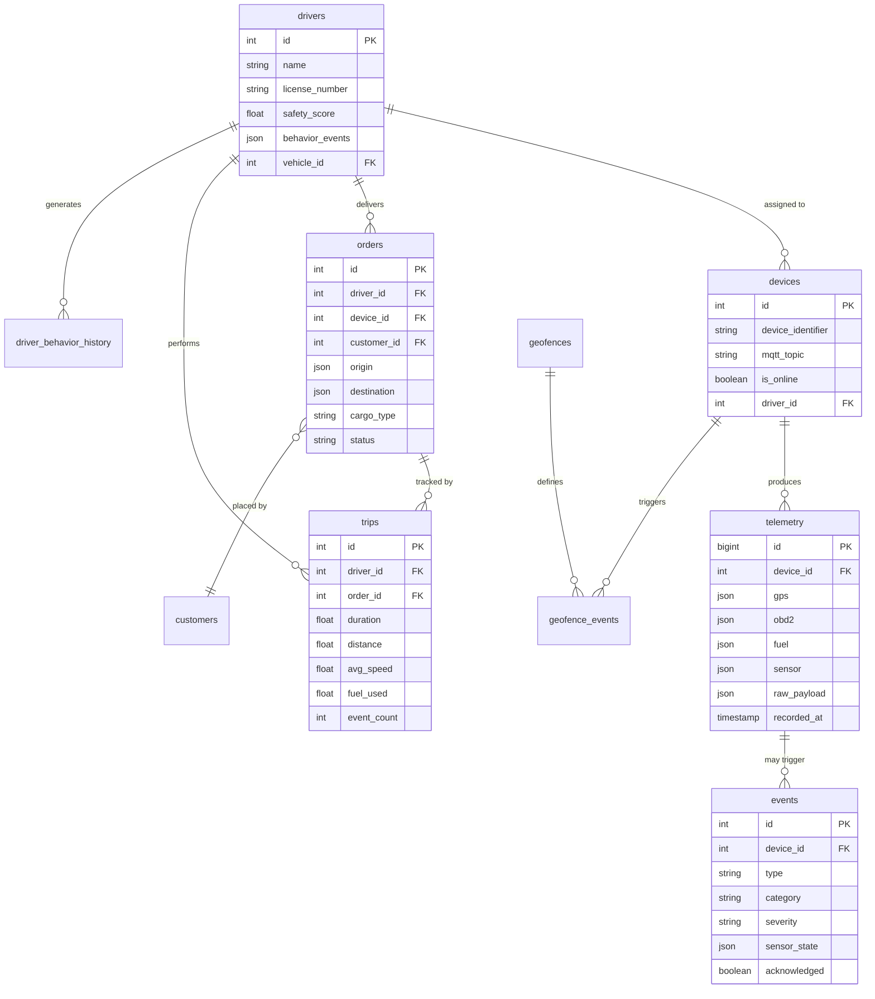
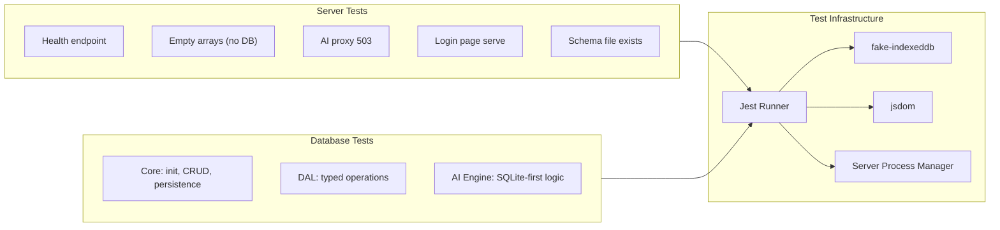
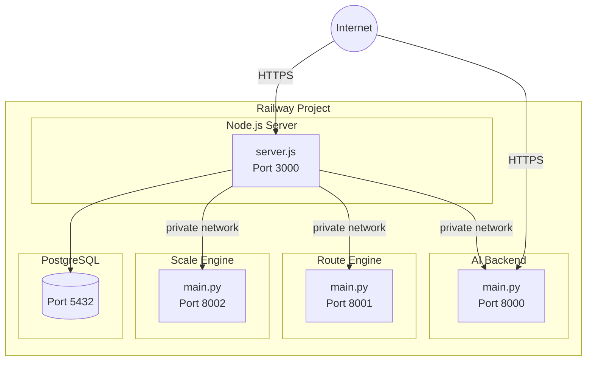

# SGU Logistics & Telemetry Dashboard

> **Intelligent Fleet Management System** — Real-time vehicle telemetry, AI-powered analytics, and logistics optimization across a distributed four-layer architecture spanning embedded hardware, cloud microservices, and a browser-based command center.

[](https://nodejs.org/)
[](https://python.org/)
[](https://arduino.cc/)
[](https://postgresql.org/)
[](https://fastapi.tiangolo.com/)
[](https://expressjs.com/)
[](LICENSE)

---

## Table of Contents

- [System Architecture](#system-architecture)
- [Data Flow](#data-flow)
- [Service Topology](#service-topology)
- [Key Innovations](#key-innovations)
- [Technology Stack](#technology-stack)
- [The 28 AI Engines](#the-28-ai-engines)
- [Project Structure](#project-structure)
- [Database Design](#database-design)
- [Getting Started](#getting-started)
- [API Reference](#api-reference)
- [Testing](#testing)
- [Deployment](#deployment)
- [Documentation Index](#documentation-index)
- [Academic Context](#academic-context)

---

## System Architecture

The platform is organized into four independent layers, each capable of operating with graceful degradation when downstream services are unavailable.



---

## Data Flow

End-to-end telemetry journey — sub-200ms from sensor silicon to dashboard pixel.



### Processing Pipeline Detail



---

## Service Topology

Four independent microservices connected via HTTP with graceful degradation at every boundary.



---

## Key Innovations

### 1. Database-First AI Architecture

The browser-side AI engine queries a local SQLite database before escalating to Gemini. This eliminates API costs for routine analytical questions.



| Metric | All-Cloud Approach | Database-First Approach |
|--------|-------------------|------------------------|
| Monthly AI API cost | ~$50 | ~$10 |
| Average query latency | 800ms | 50ms (cached) |
| Offline capability | None | Full (SQLite + IndexedDB) |

### 2. 28 Modular AI Engines

Each engine is an independent Python module that auto-registers REST endpoints via FastAPI. Engines discover related peers through a registry pattern — adding a new engine requires zero changes to existing code. Hot-swap individual engines without restarting the scale platform.

### 3. On-Device Safety Detection

The `BehaviorAnalysis` C++ module runs directly on the ESP32, detecting seven unsafe driving behaviors from raw sensor data before transmission. Safety-critical alerts have zero cloud dependency and survive network outages.

| Behavior | Detection Rule | Severity |
|----------|---------------|----------|
| Harsh Braking | Speed drop > 15 km/h within 3 seconds | Warning |
| Aggressive Launch | Throttle > 90% at speed < 30 km/h | Warning |
| Cold Engine Abuse | RPM > 3000 with coolant < 70&deg;C | Warning |
| Engine Lugging | Load > 85% with RPM < 1500 | Warning |
| Excessive Idling | Speed = 0, RPM > 500 for > 180s | Info |
| Speeding | Speed > 110 km/h | Critical |
| Unknown | Custom rule violations | Variable |

### 4. Graceful Degradation at Every Boundary

Every downstream dependency is optional. The integration connector returns structured 503 responses when engines are unreachable. The dashboard continues displaying live telemetry even when the Scale Engine, Route Engine, and AI Backend are all simultaneously offline.

### 5. Predictive Maintenance from OBD Trend Analysis

The Predictive Maintenance engine monitors longitudinal trends in coolant temperature, battery voltage, and RPM stability. Statistical drift detection triggers maintenance flags before components fail, preventing roadside breakdowns.

---

## Technology Stack

| Layer | Technology | Purpose |
|-------|-----------|---------|
| **Embedded** | Arduino C++ (ESP32, MCP2515 CAN controller) | OBD-II data capture, GPS tracking, on-device safety analysis |
| **Messaging** | MQTT 5.0 (HiveMQ public broker) | Real-time publish/subscribe telemetry transport |
| **Application Server** | Node.js 18+ / Express 4.x | REST API, SSE streaming, static asset serving |
| **Server Database** | PostgreSQL 15 | Long-term telemetry persistence, order management, geofencing |
| **Browser Database** | SQLite via sql.js (WebAssembly) | Offline cache, local analytics, cost-free AI query layer |
| **Analytics** | Python 3.9+ / FastAPI | 28 modular AI/ML microservices with auto-generated endpoints |
| **LLM Integration** | Google Gemini 2.0 Flash | Natural language fleet analysis, route scoring, report synthesis |
| **Notifications** | Telegram Bot API (python-telegram-bot) | Real-time alert delivery, on-demand PDF report generation |
| **Frontend** | Leaflet.js, Chart.js, jsPDF, Turf.js | Interactive geospatial visualization, telemetry charts, PDF export |
| **Stream Processing** | Redis Streams / NATS / In-Memory | High-throughput telemetry ingestion and routing |
| **PDF Generation** | Jinja2 + WeasyPrint | Templated PDF fleet reports |
| **Testing** | Jest, fake-indexeddb, jsdom | Isolated unit and integration tests |
| **Deployment** | Railway (Nixpacks) | Containerized, zero-configuration deployment |
| **Code Quality** | ESLint, Prettier | Consistent formatting and static analysis |

---

## The 28 AI Engines

All engines reside in `scale_engine/` and expose REST endpoints automatically through the FastAPI engine registry. Each engine is an independent module — add or remove engines without modifying the platform core.

### Engine Category Overview


### Data Ingestion (Engines 1–9)

| # | Engine | Source File | Responsibility |
|---|--------|------------|----------------|
| 1 | Stream Bus | `data_ingestion/stream_bus.py` | Distributed message routing — Redis Streams, NATS, or in-memory. Handles thousands of data points per second. |
| 2 | Timeseries Engine | `data_ingestion/timeseries_engine.py` | Temporal aggregation with configurable windows (hourly, daily, weekly) on any telemetry metric. |
| 3 | Storage Tiers | `data_ingestion/storage_tiers.py` | Hot/warm/cold data lifecycle management — recent data in memory, aged data in cold storage. |
| 4 | Schema Registry | `data_ingestion/schema_registry.py` | Validates every incoming payload against expected JSON schema; rejects malformed data. |
| 5 | Normalizer | `data_ingestion/normalizer.py` | Unit standardization pipeline — km/h &harr; mph, &deg;C &harr; &deg;F, L &harr; gal. |
| 6 | Geo Processor | `data_ingestion/geo_processor.py` | Geofence evaluation, proximity detection, route corridor analysis. |
| 7 | Fleet State | `data_ingestion/fleet_state.py` | Materialized fleet-wide projection — online count, moving count, idle count, alerting count. |
| 8 | Data Quality | `data_ingestion/data_quality.py` | Sensor health monitoring — stale data detection, gap analysis, outlier flagging. |
| 9 | Replay / Backfill | `data_ingestion/replay_backfill.py` | Historical data replay engine for backfilling telemetry after service downtime. |

### Smart Systems (Engines 10–17)

| # | Engine | Source File | Responsibility |
|---|--------|------------|----------------|
| 10 | CEP Engine | `smart_systems/cep_engine.py` | Complex Event Processing — multi-condition rule chains (e.g., "speeding AND coolant > 110&deg;C" triggers CRITICAL). |
| 11 | Anomaly Detector | `smart_systems/anomaly_detector.py` | Statistical outlier detection across fleet-wide behavior patterns using Z-score and IQR methods. |
| 12 | Digital Twin | `smart_systems/digital_twin.py` | Virtual vehicle state model updated in real-time from the sensor stream — mirrors physical vehicle. |
| 13 | Behavior Inference | `smart_systems/behavior_inference.py` | Longitudinal driver scoring with trend analysis and automated coaching recommendations. |
| 14 | Predictive Maintenance | `smart_systems/predictive_maintenance.py` | Failure probability estimation from OBD trends — coolant, voltage, RPM stability. |
| 15 | Fleet Optimizer | `smart_systems/fleet_optimizer.py` | Dispatch optimization — driver-to-order matching, load balancing, schedule optimization. |
| 16 | Route ETA | `smart_systems/route_eta.py` | ETA prediction engine with and without driver behavior history features. |
| 17 | Signal Fusion | `smart_systems/signal_fusion.py` | Multi-sensor fusion (GPS + OBD + accelerometer) for higher-accuracy speed and position estimation. |

### AI / ML (Engines 18–25)

| # | Engine | Source File | Responsibility |
|---|--------|------------|----------------|
| 18 | Feature Store | `ai_ml/feature_store.py` | Computes feature vectors from raw telemetry for ML model training and inference. |
| 19 | Model Trainer | `ai_ml/model_trainer.py` | Trains ML models — driver risk classification, fuel efficiency regression, maintenance prediction. |
| 20 | Model Server | `ai_ml/model_server.py` | Low-latency model inference serving for real-time prediction requests. |
| 21 | Vector RAG | `ai_ml/vector_rag.py` | Retrieval-Augmented Generation with semantic vector search over fleet operational history. |
| 22 | Forecaster | `ai_ml/forecaster.py` | Time-series forecasting for fuel consumption and delivery delay prediction. |
| 23 | Knowledge Graph | `ai_ml/knowledge_graph.py` | Fleet-wide relationship model — drivers, vehicles, routes, orders, and their interactions. |
| 24 | MLOps | `ai_ml/mlops.py` | Model lifecycle management — versioning, drift detection, automated rollback triggers. |
| 25 | AI Orchestrator | `ai_ml/ai_orchestrator.py` | Multi-agent coordination layer — routes tasks between engines based on capability registry. |

### Edge / Cloud Bridge (Engines 26–28)

| # | Engine | Source File | Responsibility |
|---|--------|------------|----------------|
| 26 | Edge Model Manager | `edge_cloud/edge_model_mgr.py` | Model compression, quantization, and rollout to edge devices with confirmation tracking. |
| 27 | Sync Engine | `edge_cloud/sync_engine.py` | Bidirectional cloud-to-edge data synchronization with conflict resolution. |
| 28 | Federated Learning | `edge_cloud/federated_learning.py` | Federated learning round management — models improve from edge data without raw data leaving the device. |

### System Introspector

| Engine | Source File | Responsibility |
|--------|------------|----------------|
| System Analyzer | `system_analyzer.py` | AI-powered full-system introspection — engine health, data flow status, cross-service diagnostics. |

---

## Project Structure

```
Vision/
|
|-- Frontend
|   |-- index.html                   Main dashboard (Leaflet maps, Chart.js, AI chat)
|   |-- login.html                   Authentication page
|   |-- login.js                     Authentication logic
|   |-- login.css                    Authentication styles
|   +-- z_logo.png                   Project brand asset
|
|-- Backend (Node.js)
|   |-- server.js                    Express server — MQTT, REST API, SSE, proxy
|   |-- package.json                 Dependencies and npm scripts
|   |-- .env.example                 Environment variable template with documentation
|   |-- .eslintrc.cjs                ESLint configuration
|   |-- .prettierrc                  Prettier configuration
|   +-- jest.config.js               Jest test runner configuration
|
|-- Integration Bridge
|   +-- integration/
|       +-- connector.js             HTTP proxy layer — Node.js to Python microservices
|
|-- AI Engines (Python / FastAPI)
|   |-- scale_engine/                Port 8002 — 28-engine intelligence platform
|   |   |-- main.py                  FastAPI application & engine registry
|   |   |-- system_analyzer.py       AI system introspection engine
|   |   |-- db.py                    Engine database utilities
|   |   |-- data_ingestion/          9 engines — stream bus, timeseries, geo, etc.
|   |   |-- smart_systems/           8 engines — CEP, anomaly, digital twin, etc.
|   |   |-- ai_ml/                   8 engines — feature store, models, forecast, etc.
|   |   +-- edge_cloud/              3 engines — edge models, sync, federated learning
|   |
|   |-- route_engine/                Port 8001 — Route optimization service
|   |   |-- main.py                  FastAPI application
|   |   |-- route_analyzer.py        Hybrid AI + deterministic route scoring
|   |   |-- behavior_integrator.py   Driver behavior data integration
|   |   |-- report_pipeline.py       4-stage report generation pipeline
|   |   +-- db.py                    Route database queries
|   |
|   +-- ai_backend/                  Port 8000 — AI analysis & Telegram notifications
|       |-- main.py                  FastAPI application
|       |-- analyzer.py              Fleet analyzer (Gemini 2.0 Flash wrapper)
|       |-- telegram_bot.py          Telegram bot command handlers
|       |-- report_generator.py      PDF report generator (Jinja2 + WeasyPrint)
|       +-- db.py                    Fleet snapshot query helpers
|
|-- Database Module
|   +-- database/
|       |-- db.js                    Core SQLite engine (sql.js WASM) — init, auto-save
|       |-- dal.js                   Data Access Layer — typed CRUD for all 12 tables
|       |-- service.js               High-level service API with business logic
|       |-- ai-engine.js             Smart AI — SQLite-first query, Gemini fallback
|       |-- migrate.js               Legacy localStorage to SQLite migration
|       |-- integration.js           Global function patching for database use
|       |-- loader.js                Single script include for HTML pages
|       |-- schema.sql               Browser SQLite schema (12 tables)
|       |-- pg-schema.sql            PostgreSQL schema (12 tables + 4 views)
|       +-- README.md                Database architecture reference
|
|-- Embedded Firmware (Arduino C++)
|   |-- GPS_device.ino               GPS module firmware (ESP32)
|   |-- obd2_scanner.ino             OBD-II CAN bus scanner (ESP32 + MCP2515)
|   |-- BehaviorAnalysis.h           On-device safety detection (header)
|   +-- BehaviorAnalysis.cpp         On-device safety detection (implementation)
|
|-- Test Suite
|   +-- tests/
|       |-- server.test.js           7 server integration tests
|       |-- helpers/
|       |   |-- server-process.js    Isolated server process manager
|       |   +-- browser-db-harness.js Browser DB test environment (jsdom)
|       +-- database/
|           |-- ai-engine.test.js    Smart AI engine unit tests
|           |-- dal.test.js          Data Access Layer unit tests
|           +-- db.test.js           Core database unit tests
|
|-- Documentation
|   |-- README.md                    Primary project documentation
|   |-- FULL_SYSTEM_DECOMPOSITION.md Complete 6-layer architectural decomposition
|   |-- SYSTEM_AT_A_GLANCE.md        Visual reference with system diagrams
|   |-- THESIS_EXPLANATION.md        Thesis overview, innovations, and Q&A
|   |-- PRESENTATION_GUIDE.md        Defense presentation guide and talking points
|   |-- Code Architecture.drawio     Full visual architecture diagram (Draw.io)
|   +-- root/About/
|       |-- AI-UPGRADE.md            AI architecture evolution narrative
|       +-- AI-TEST.md               Database-first AI testing methodology
|
+-- Deployment
    |-- railway.json                 Node.js server deployment configuration
    |-- ai_backend/railway.json      AI backend deployment configuration
    |-- route_engine/railway.json    Route engine deployment configuration
    +-- scale_engine/railway.json    Scale engine deployment configuration
```

---

## Database Design

Dual-database architecture — PostgreSQL for server-side persistence, SQLite (WebAssembly) for browser-side caching. Both databases share schema parity across 12 tables.



### Database Views

| View | Purpose |
|------|---------|
| `v_active_orders` | Orders not yet completed or cancelled, joined with driver and device info |
| `v_device_latest_telemetry` | Most recent telemetry record per device (avoids expensive subquery) |
| `v_event_summary_24h` | Event counts grouped by type within the trailing 24-hour window |
| `v_order_stats` | Order aggregations — counts by status, type, and assigned driver |

Full schema definitions: [database/pg-schema.sql](database/pg-schema.sql) (PostgreSQL, 293 lines) | [database/schema.sql](database/schema.sql) (SQLite, 456 lines)

---

## Getting Started

### Prerequisites

| Software | Minimum Version | Required | Purpose |
|----------|----------------|----------|---------|
| Node.js | 18.0.0 | Required | Express application server |
| Python | 3.9 | Optional | AI microservices (degrade gracefully if absent) |
| PostgreSQL | 15 | Optional | Persistent telemetry storage |
| Arduino IDE | 2.x | Optional | ESP32 firmware deployment |
| Gemini API Key | — | Optional | AI-powered analysis features |

### 1. Clone and Install

```bash
git clone https://github.com/moonr5/Vision.git
cd Vision
npm install
```

### 2. Configure Environment

```bash
cp .env.example .env
```

| Variable | Required | Default | Description |
|----------|----------|---------|-------------|
| `DATABASE_URL` | For persistence | — | PostgreSQL connection string |
| `PORT` | No | `3000` | Express server port |
| `GEMINI_API_KEY` | No | — | Google Gemini API key |
| `TELEGRAM_BOT_TOKEN` | No | — | Telegram bot token from @BotFather |
| `TELEGRAM_CHAT_ID` | No | — | Restrict bot to a single chat ID |
| `PYTHON_AI_URL` | No | — | AI backend service URL |
| `ROUTE_ENGINE_URL` | No | — | Route engine service URL |
| `SCALE_ENGINE_URL` | No | — | Scale engine service URL |

### 3. Start the Server

```bash
npm start
```

The dashboard is available at `http://localhost:3000`.

### 4. Start Python Microservices (Optional)

Each service runs independently and the system degrades gracefully without them.

```bash
# Terminal 1 — AI Backend (Gemini analysis + Telegram bot)
cd ai_backend
pip install -r requirements.txt
uvicorn main:app --port 8000

# Terminal 2 — Route Engine (route optimization)
cd route_engine
pip install -r requirements.txt
uvicorn main:app --port 8001

# Terminal 3 — Scale Engine (28 AI engines)
cd scale_engine
pip install -r requirements.txt
uvicorn main:app --port 8002
```

### 5. Deploy Arduino Firmware

1. Open `obd2_scanner.ino` in the Arduino IDE
2. Select board: **ESP32 Dev Module**
3. Configure WiFi SSID and password in the sketch
4. Wire the MCP2515 CAN controller to the ESP32 SPI pins
5. Upload to the device

---

## API Reference

### Node.js Application Server — Port 3000

| Method | Endpoint | Response | Description |
|--------|----------|----------|-------------|
| `GET` | `/` | `text/html` | Authentication page |
| `GET` | `/api/stream` | `text/event-stream` | Server-Sent Events live telemetry feed |
| `GET` | `/api/telemetry/latest` | `application/json` | Most recent telemetry record per device |
| `GET` | `/api/telemetry/:deviceId` | `application/json` | Telemetry history for a device (limit: 1000) |
| `GET` | `/api/events` | `application/json` | Recent events across all devices (limit: 500) |
| `GET` | `/api/devices` | `application/json` | All registered IoT devices with status |
| `POST` | `/api/ai/analyze` | `application/json` | Proxy analysis request to Python AI backend |
| `GET` | `/health` | `application/json` | Full system health — DB, MQTT, SSE, all engines |

### Route Engine — Port 8001

| Method | Endpoint | Description |
|--------|----------|-------------|
| `POST` | `/api/route/analyze` | Score three candidate routes across five dimensions for a given driver |
| `POST` | `/api/route/compare` | Compare routes without driver context; optionally rank drivers for the best route |
| `POST` | `/api/route/driver-match` | Find the optimal driver for a fixed route based on behavior history |
| `POST` | `/api/route/report` | Execute the four-stage report pipeline (Collect, Analyze, AI-Synthesize, Output) |
| `GET` | `/api/route/driver/{id}` | Retrieve a driver's complete behavior profile |
| `GET` | `/api/route/drivers` | List all drivers with behavior summaries |

### Scale Engine — Port 8002

Fifty-plus auto-registered endpoints — one per engine. See [scale_engine/main.py](scale_engine/main.py) for the complete engine registry and endpoint map.

### AI Backend — Port 8000

| Method | Endpoint | Description |
|--------|----------|-------------|
| `POST` | `/api/ai/analyze` | Fleet-wide analysis via Gemini 2.0 Flash with database context |
| `POST` | `/api/ai/telegram-webhook` | Telegram Bot API webhook endpoint |

---

## Testing

```bash
npm test                  # Full test suite (sequential execution)
npm run test:server       # Server integration tests only
npm run test:database     # Database module tests only
npm run lint              # ESLint static analysis
npm run lint:fix          # ESLint with automatic fixes
npm run format            # Prettier formatting
npm run format:check      # Prettier format verification
```

### Test Architecture



| Test File | Coverage | Dependencies |
|-----------|----------|--------------|
| [tests/server.test.js](tests/server.test.js) | 7 integration tests — health checks, proxy behavior, static serving | Jest |
| [tests/database/db.test.js](tests/database/db.test.js) | Core SQLite — initialization, CRUD operations, IndexedDB persistence | Jest + fake-indexeddb |
| [tests/database/dal.test.js](tests/database/dal.test.js) | Data Access Layer — typed operations for all tables | Jest + jsdom |
| [tests/database/ai-engine.test.js](tests/database/ai-engine.test.js) | Smart AI — database-first query routing and fallback logic | Jest + jsdom |

---

## Deployment

### Railway (Recommended)

Each service deploys independently via Nixpacks with zero configuration. Services communicate over Railway's private network (`*.railway.internal`).



```bash
# Deploy each service independently
railway up                          # Node.js server
cd ai_backend && railway up         # AI backend
cd route_engine && railway up       # Route engine
cd scale_engine && railway up       # Scale engine
```

Each service directory contains its own `railway.json` (runtime configuration) and `nixpacks.toml` (build configuration).

### Visual Architecture Diagram

The file [Code Architecture.drawio](Code%20Architecture.drawio) contains the complete system integration map. Open with [app.diagrams.net](https://app.diagrams.net/).

---

## Documentation Index

| Document | Content |
|----------|---------|
| [README.md](README.md) | Primary documentation — architecture, data flow, API reference, setup guide |
| [FULL_SYSTEM_DECOMPOSITION.md](FULL_SYSTEM_DECOMPOSITION.md) | Complete architectural decomposition of all six system layers with extension points |
| [SYSTEM_AT_A_GLANCE.md](SYSTEM_AT_A_GLANCE.md) | Visual quick-reference with system diagrams, folder map, and data journey sequence |
| [THESIS_EXPLANATION.md](THESIS_EXPLANATION.md) | Thesis executive summary, five innovation claims, use cases, common Q&A |
| [PRESENTATION_GUIDE.md](PRESENTATION_GUIDE.md) | Defense presentation structure, 30-second elevator pitch, demo script, anticipated questions |
| [database/README.md](database/README.md) | Database architecture, API reference, schema documentation, troubleshooting guide |
| [root/About/AI-UPGRADE.md](root/About/AI-UPGRADE.md) | Evolution from cloud-only AI to database-first architecture |
| [root/About/AI-TEST.md](root/About/AI-TEST.md) | Methodology for testing the SQLite-first AI query engine |
| [Code Architecture.drawio](Code%20Architecture.drawio) | Full visual system architecture diagram |

---

## Academic Context

This project was developed as a university capstone thesis, demonstrating competency across the full engineering stack:

| Domain | Implementation |
|--------|---------------|
| **IoT & Fog Computing** | Edge processing on ESP32 — safety detection runs on-device, independent of cloud connectivity |
| **Distributed Systems** | Four independent microservices with structured graceful degradation at every integration boundary |
| **Machine Learning Pipeline** | Twenty-eight engines spanning the complete ML lifecycle — ingestion, feature engineering, training, serving, monitoring, and edge deployment |
| **Database Architecture** | Dual PostgreSQL + SQLite design with full schema parity and automated migration between tiers |
| **Full-Stack Engineering** | Hardware (C++) to application server (Node.js) to AI services (Python) to presentation layer (HTML5/JavaScript) |
| **Cost-Efficient AI Design** | Empirical demonstration that a database-first query architecture eliminates 80–85% of LLM API calls without reducing analytical capability |

---

## License

SGU Logistics & Telemetry Dashboard is published under the **GNU Lesser General
Public License, Version 3** (LGPLv3). See [LICENSE](LICENSE) for the full
license text and [COPYRIGHT](COPYRIGHT) for copyright and third-party
attribution information.

---

<p align="center">
  <sub>Built for safer, smarter fleet operations — Arduino &bull; Node.js &bull; Python &bull; PostgreSQL &bull; Gemini AI</sub>
</p>
